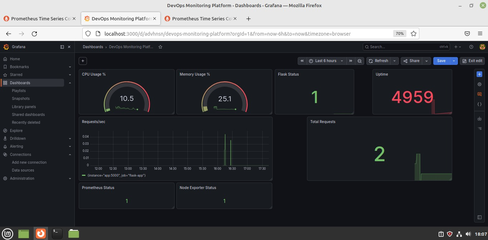

# DevOps Monitoring Platform

Proyecto práctico orientado a monitoreo, observabilidad y automatización utilizando herramientas del ecosistema DevOps.

## Arquitectura

```text
GitHub Actions
      │
      ▼
Terraform
      │
      ▼
Docker Compose
      │
 ┌──────────────┐
 │ Flask App    │
 └──────────────┘
      │
      ▼
 Prometheus
      │
      ▼
  Grafana
      │
      ▼
Node Exporter
```

## Tecnologías

- AWS
- Linux
- Docker
- Docker Compose
- Terraform
- Prometheus
- Grafana
- Python (Flask)
- GitHub Actions

## Features

- Monitoreo de infraestructura mediante Node Exporter
- Recolección de métricas con Prometheus
- Visualización mediante Grafana
- Aplicación instrumentada en Flask
- CI/CD mediante GitHub Actions
- Infraestructura como código con Terraform

## Dashboard


